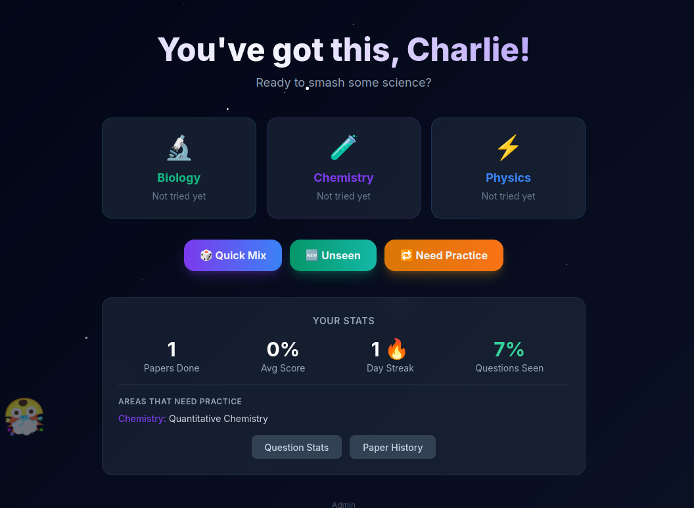

# GCSE Science Revision Tool

A focused revision app for AQA Combined Science: Trilogy (Foundation tier). Built for a single student preparing for the Edge Hill University Science Equivalence Exam.



---

## What it does

- **Three subjects** — Biology, Chemistry, Physics
- **Timed MCQ papers** — 25 minutes, exam-style questions with explanations
- **Smart modes** — Quick Mix, Unseen questions only, or Need Practice (questions you've scored below 50% on)
- **Progress tracking** — per-topic stats, question history, day streaks
- **Paper review** — step through any previous attempt and see correct answers
- **Cross-device** — progress syncs via a private server, not just local storage
- **ADHD-friendly** — dark theme, animated stars, floating emoji

---

## Tech

React + TypeScript + Vite + Tailwind, served by an Express API with bcrypt auth and session tokens. Docker + Caddy for deployment with automatic TLS.

---

## Vibe coded

This project was built entirely through conversation with [Claude Code](https://claude.ai/code) — no code was written by hand. The questions, UI, auth system, Docker setup, and deployment were all produced iteratively by describing what was needed and letting the model figure out the implementation.

---

## Running locally

```bash
npm install
npm run dev        # starts Vite (port 5173) + API server (port 3001)
```

## Deploying

```bash
./scripts/deploy.sh   # builds Docker image, restores data, starts services
```

Manage users via:

```bash
docker compose exec app node server/admin.js add-user <name> <password>
docker compose exec app node server/admin.js list-users
docker compose exec app node server/admin.js change-password <name> <newpassword>
```

## Data

User progress is stored in `server/data/` (gitignored) and persisted in a named Docker volume. Backups are written to `backups/` (also gitignored) on each deploy.
